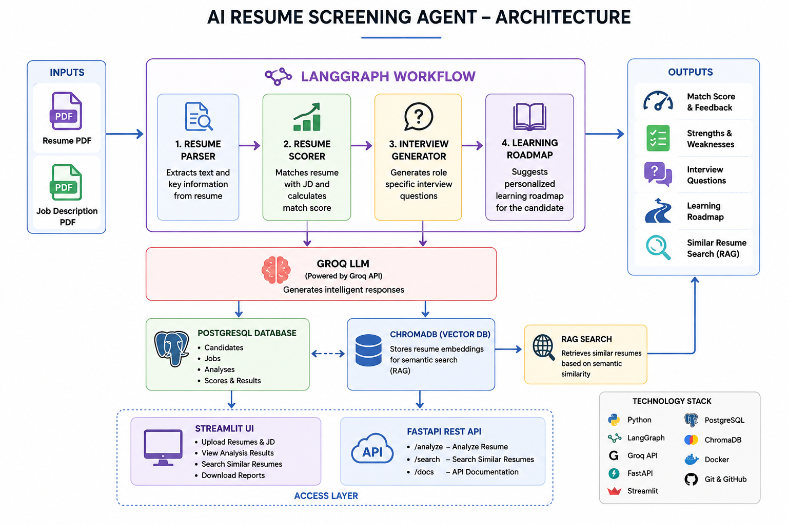

# 🤖 AI Resume Screening Agent

An AI-powered Resume Screening Agent that leverages Large Language Models (LLMs), LangGraph, Retrieval-Augmented Generation (RAG), PostgreSQL, ChromaDB, FastAPI, Streamlit, and Docker to automate resume screening, candidate evaluation, interview question generation, and semantic resume search.

---

# 📌 Overview

AI Resume Screening Agent is an end-to-end AI application designed to simplify the recruitment process. It analyzes resumes against job descriptions using LLMs, calculates candidate-job match scores, identifies strengths and missing skills, generates personalized interview questions and learning roadmaps, and enables semantic resume search using vector embeddings.

The project demonstrates modern AI Engineering concepts including Agentic AI, LangGraph workflow orchestration, Retrieval-Augmented Generation (RAG), REST API development, vector databases, containerization, and cloud-ready architecture.

---

# ✨ Features

- AI Resume Parsing
- Resume vs Job Description Matching
- LangGraph Workflow Orchestration
- AI Interview Question Generator
- Personalized Learning Roadmap
- Semantic Resume Search (RAG)
- ChromaDB Vector Database
- PostgreSQL Storage
- FastAPI REST APIs
- Streamlit Dashboard
- Dockerized Deployment

---

# 🏗️ Architecture



---

# ⚙️ Tech Stack

### Programming Language

- Python

### AI & LLM

- Groq API
- Ollama
- LangGraph

### Backend

- FastAPI
- SQLAlchemy

### Frontend

- Streamlit

### Database

- PostgreSQL
- ChromaDB

### DevOps

- Docker
- Git
- GitHub

---

# 📂 Project Structure

```
AI_Resume_Screening_Agent/

├── agents/
├── api/
├── database/
├── models/
├── services/
├── utils/
├── uploads/
├── app.py
├── docker-compose.yml
├── requirements.txt
├── README.md
└── .env.example
```

---

# 🚀 Installation

```bash
git clone <repository-url>

cd AI_Resume_Screening_Agent

python -m venv venv

venv\Scripts\activate

pip install -r requirements.txt
```

Create a `.env` file using `.env.example`.

Run Streamlit:

```bash
streamlit run app.py
```

Run FastAPI:

```bash
uvicorn api.main:app --reload
```

---

# 🐳 Docker Setup

```bash
docker compose build

docker compose up
```

---

# 🔥 FastAPI Endpoints

| Method | Endpoint | Description |
|---------|----------|-------------|
| GET | / | Home API |
| GET | /health | Health Check |
| POST | /analyze | Resume Analysis |
| POST | /search | Semantic Resume Search |

Swagger Documentation:

```
http://127.0.0.1:8000/docs
```

---

# 🖥️ Streamlit Demo

Run:

```bash
streamlit run app.py
```

Open:

```
http://localhost:8501
```

---

# 📸 Screenshots

- Home Screen
- Resume Analysis
- Interview Questions
- Learning Roadmap
- FastAPI Swagger
- Docker Containers

---

# 📈 Future Improvements

- Authentication & Authorization
- Multi-user Support
- Cloud Deployment (AWS/Azure/GCP)
- Background Jobs using Celery
- PDF Report Generation
- Analytics Dashboard
- Kubernetes Deployment
- CI/CD Pipeline

---

# 👨‍💻 Author

**Gautam Gupta**

Information Technology Engineer

GitHub:
https://github.com/GTGautam16

LinkedIn:
https://linkedin.com/in/gautam-gupta-it

Website:
FASTAPI (Backend) : https://ai-resume-screening-agent-api.onrender.com/docs
Streamlit (Frontend) : https://ai-resume-screening-agent-6nlmnxqb8o7vovrwstun2u.streamlit.app/